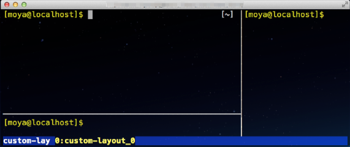

tmux-agent - tmux initial action agent
==========

- [Background](#background)
- [Overview](#overview)
- [Installation](#installation)
- [Completion](#completion)
    - [Bash](#bash)
    - [Zsh](#zsh)
- [Usage](#usage)
- [Additional Functions](#additional-functions)
- [File Format](#file-format)
    - [Keys](#keys)
    - [Variables](#variables)
    - [Comment](#comment)
    - [Indentation](#indentation)
    - [Blank line](#blank-line)
- [Sample Initial Action Files](#sample-initial-action-files)
- [Comparison with tmuxinator](#comparison-with-tmuxinator)
- [Test Environment](#test-environment)

Background
----------

**[tmux](http://tmux.sourceforge.net)** is a very useful multifunctional terminal multiplexer.
I use tmux habitually, and like tmux's behavior basically. 
But initial actions that are creations of windows/panes, layouts sets, movements between directories, ssh to remote servers and so on become troublesome as tmux is used for various works.

A simple solution of that is coding scripts with tmux commands. However the coding is troublesome, too.

More better solution is using **[tmuxinator](https://github.com/tmuxinator/tmuxinator)**. The tmuxinator loads Yaml files, and manages complex tmux sessions according to the Yaml files.

**tmux-agent** is a similar tool, too. Or the **tmux-agent** loads simple format files (not Yaml) that present initial actions, and acts according to the contents. **tmux-agent** has some good/poor features as compared to tmuxinator. For details, see [Comparison with tmuxinator](#comparison-with-tmuxinator).

Overview
----------

tmux-agent is a simple bash script. It depends on bash, tmux, and basic Linux/BSD commands. 

A loaded file is comma separated format (key:value). Examples are as follows.

- Open 2 windows and ssh app1, app2 servers. Then hostname command on remote servers are executed.

        # file: app-ssh-windows
        session: app-ssh-windows
          window-command: ssh ${window}
          window-command: hostname
          window: app{1,2}

- Open 1 window and 3 panes. Then ssh web1 -- web3 servers. Then logs of the web servers are displayed by tail command. At last, the panes are synchronized.

        # file: web-log-sync-ssh-panes
        session: web-log-sync-ssh-panes
          pane-command: ssh ${pane}
          pane-command: tail -f /var/log/httpd/access_log
          pane-sync:
          pane: web{1..3}

- Target hosts are specified by command line arguments. And layout is set to "even-horizontal".

        # file: sync-ssh-panes
        session: ${file}_${id}_${argv}
          pane-command: ssh -l moya ${pane}
          pane-sync:
          pane-layout: even-horizontal
          pane: ${argv}

The files are expected to be located a certain directory (default: `~/.tmux-agent/`).

tmux-agent is used as follows. 

    $ tmux-agent app-ssh-windows

    $ tmux-agent web-log-sync-ssh-panes

    $ tmux-agent sync-ssh-panes dev{1,2} stg

Installation
----------

Installation example is as follows.
In this example, tmux-agent is installed in `~/bin` (The directory is expected to be included in PATH environment variable)

    $ git clone git://github.com/mo-ya/tmux-agent.git

If git is not available in your system, download a zip file from https://github.com/mo-ya/tmux-agent and extract that.

    $ cd tmux-agent
    
    $ cp bin/tmux-agent.sh ~/bin/tmux-agent
    
    $ chmod 755 ~/bin/tmux-agent
    
    $ cp -r init-action-files.sample ~/.tmux-agent

Please test as follows.

    $ tmux-agent install-test

"install-test" session will start. Please check each window. (Messages may be displayed redundantly. That is not an elegant expression. But that is an expected behavior.)

If the checks pass, the installation is completed. 

If you use Bash or Zsh, the usability could be increased more. Please read a next section. There are the usage description and the detail of file format below that.

Completion
----------

## Bash

Please move the directory where tmux-agent is downloaded. Then, copy "bashrc.tmux-agent" to your home directory.

    $ cp completion/bashrc.tmux-agent ~/.bashrc.tmux-agent

Then add a following description into ~/.bashrc .

    source ${HOME}/.bashrc.tmux-agent

After .bashrc is reloaded, input tmux-agent &lt;TAB&gt;. As a result, initial action files are complemented as follows.

    $ tmux-agent <TAB>

    app-ssh-windows     no-title          tail-webservs-log
    multi-ssh-windows   sync-ssh-panes    web-log-sync-ssh-panes

## Zsh

Please move the directory where tmux-agent is downloaded. Then, copy "zshrc.tmux-agent" to your home directory.

    $ cp completion/zshrc.tmux-agent ~/.zshrc.tmux-agent

Then add a following description into ~/.zshrc under `autoload -U compinit ; compinit` description.

    ZSHRC=${HOME}/.zshrc.tmux-agent
    [ -f ${ZSHRC} ] && source ${ZSHRC}

After .zshrc is reloaded, input tmux-agent &lt;TAB&gt;. As a result, initial action files (and attached/detached sessions) are complemented as follows.

    $ tmux-agent <TAB>

    multi-ssh-windows   -- init-action
    multi-ssh-windows0  -- attached
    multi-ssh-windows1  -- detached
    no-title            -- init-action
    no-title0           -- detached
    sync-ssh-panes      -- init-action
    tail-webservs-log   -- init-action
    tail-webservs-log   -- attached

Usage
----------

Use tmux-agent as following steps.

1.  Prepare your initial action file. See [File Format](#file-format) and [Samples](./init-action-files.sample) for reference.

2.  Locate the file in `~/.tmux-agent/`.

3.  Execute `tmux-agent <file>` (If you use ${argv}, execute `tmux-agent <file> [arguments ..]`)

4.  Do the initial actions fulfill your expectation?
    
    If you are not satisfied, please modify the initial action file.
    
5.  The role of tmux-agent is all. After that, please operate tmux by normal methods.

Additional Functions
----------

### Load an existing session

If you specified existing (attached/detached) session
 as an argument of tmux-agent, the session is attached.
 
    $ tmux-agent <session>

If a initial action file with the same name is existing, loading the file is prior.

File Format
----------

### Keys

<table>
  <tr>
    <th>Key</th>
    <th>Description</th>
    <th>Position</th>
    <th>Default value</th>
    <th>Available variables</th>
    <th>Comments</th>
  </tr>
  <tr>
    <th>session</th>
    <td>Session name</td>
    <td>Top of a file</td>
    <td>${file}${id}</td>
    <td>${file}, ${id}, ${argv}</td>
    <td>This key is necessary. (Other keys are optional). If a session with the same name exists already, the existing session is attached. If you want to open another session by the same action, use ${id}. The variable is replaced with an unique number. Spaces and dots are replaced to underscores automatically.</td>
  </tr>
  <tr>
    <th>window</th>
    <td>Window name</td>
    <td>Anywhere</td>
    <td>Same as session</td>
    <td>${file}, ${argv}</td>
    <td>If two or more words are specified, multiple windows are created for each word. In addition, brace expansion of bash is available. For example, <code>host{1,2,5}</code> is treated as <code>host1 host2 host5</code>, <code>id{9..12}</code> is treated as <code>id9 id10 id11 id12</code>, and so on. </td>
  </tr>
  <tr>
    <th>window-command</th>
    <td>Command executed in the target window</td>
    <td>Above target <strong>window</strong> description</td>
    <td>nothing</td>
    <td>${file}, ${window}</td>
    <td>The command is executed in each window. ${window} is replaced with value of "window".</td>
  </tr>
  <tr>
    <th>pane</th>
    <td>Pane name</td>
    <td>Below target <strong>window</strong> (If window is nothing, anywhere)</td>
    <td>Same as window</td>
    <td>${file}, ${argv}</td>
    <td>If two or more words are specified, multiple panes are created for each word. Brace expansion of bash is available as same as window. </td>
  </tr>
  <tr>
    <th>pane-command</th>
    <td>Command executed in the target pane</td>
    <td>Above target <strong>pane</strong> description</td>
    <td>nothing</td>
    <td>${file}, ${window}, ${pane}</td>
    <td>The command is executed in each pane. ${pane} and ${window} are replaced with value of "pane" and "window".</td>
  </tr>
  <tr>
    <th>pane-sync</th>
    <td>Synchronize the target pane (and panes in the same window)</td>
    <td>Above target <strong>pane</strong> description</td>
    <td>nothing</td>
    <td>none</td>
    <td>The value is not needed.</td>
  </tr>
  <tr>
    <th>pane-layout</th>
    <td>Set layout</td>
    <td>Above target <strong>pane</strong> description</td>
    <td>even-vertical</td>
    <td>none</td>
    <td>Available values are <strong><a target="_blank" href="http://www.openbsd.org/cgi-bin/man.cgi?query=tmux">layout-names of tmux</a></strong> (ex. even-vertical, tiled, ...), and a previously used layout (ex. <code>bb62,159x48,0,0{79x48,0,0,79x48,80,0}</code>). </td>
  </tr>
</table>

- Memo: How to get the layout of current windows in a form suitable for use with pane-layout

        $ tmux list-window -a -F "#S: #W: #{window_layout}"

        session: window: 77cf,80x24,0,0{54x24,0,0[54x16,0,0,828,54x7,0,17,830],25x24,55,0,829}

  `77cf,80x24,0,0{...` -- `..,55,0,829}` is available as a layout. For example,

        # file: custom-layout
        session:
          pane-layout: 77cf,80x24,0,0{54x24,0,0[54x16,0,0,828,54x7,0,17,830],25x24,55,0,829}
          pane: {0..2}

  

### Variables

<table>
  <tr>
    <th>Variable</th>
    <th>Replaced with ...</th>
    <th>Supported keys</th>
    <th>Comments</th>
  </tr>
  <tr>
    <th>${file}</th>
    <td>Initial action file name</td>
    <td>session, window, window-command, pane, pane-command</td>
    <td></td>
  </tr>
  <tr>
    <th>${id}</th>
    <td>Integer (0,1,2,...)</td>
    <td>session</td>
    <td>It is automatically increased, if same number is already used in the same session name.</td>
  </tr>
  <tr>
    <th>${argv}</th>
    <td>Command line arguments</td>
    <td>session, window, pane</td>
    <td>For example, <code>tmux-agent &lt;init-file&gt; a b{1,2} c{9..11}</code> is executed, ${argv} is replaced with <code>a b1 b2 c9 c10 c11</code></td>
  </tr>
  <tr>
    <th>${window}</th>
    <td>Value of target window</td>
    <td>window-command, pane-command</td>
    <td></td>
  </tr>
  <tr>
    <th>${pane}</th>
    <td>Value of target pane</td>
    <td>pane-command</td>
    <td></td>
  </tr>
</table>

### Comment

Lines with **#** at line head are ignored. These are treated as comments.

### Indentation

Indents are ignored. Indents in above examples are inserted for readability only.

### Blank line

Blank lines are ignored. 

Sample Initial Action Files
----------

See [Samples](./init-action-files.sample)

Comparison with tmuxinator
----------

- Advantages
    - Brace expansion of bash is available.
        - ex. {a,b,c}, {4..8}
    - Description of similar actions in multi windows and panes can be written simply. In a following example, 6 windows are started, and 3 panes are started in each window. Then ssh logins and displays of logs are executed in each pane.
    
            # file: remote-servers-log-display
            session:
              window: app{8,9} web{3..6}
                pane-command: ssh ${window}
                pane-command: tail -f /var/log/${pane}
                pane: messages secure cron 
    - Command line arguments can be used in actions by ${argv} variable. So target hosts etc. can be changed dynamically.
    - Multi sessions can be started from one initial action file by using ${id}.
- Disadvantages
    - tmuxinator's file format (Yaml) is constructive. So readability of the files are better than tmux-agent's initial action files.
    - An editor is started by a tmuxinator option. On the other hand, tmux-agent's initial action files must be edited by starting a editor manually.

Test Environment
----------

- Tmux: **1.9a**

- OS, bash
    - OS: **Mac OS X 10.9.4 (Mavericks)**, bash: **GNU bash, version 3.2.51(1)-release**
    - OS: **CentOS 6.5**, bash: **GNU bash, version 4.1.2(1)-release**
